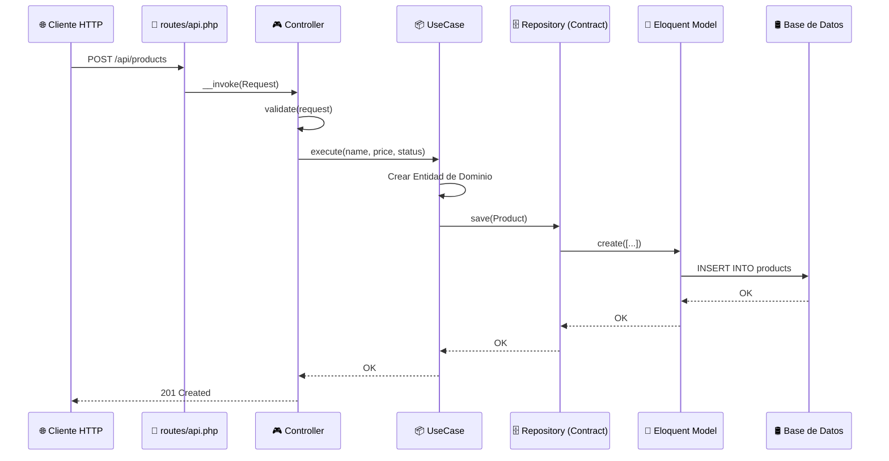

# 📘 Guía para Crear un Módulo en AlmhaBackendV2

Esta guía explica paso a paso cómo crear un nuevo módulo (modelo/entidad) siguiendo la **Arquitectura Hexagonal** que utiliza este proyecto.

---

## 📁 Estructura de Carpetas

Cada módulo vive dentro de un **bounded context** (ej. `Admin`, `Landing`) y se divide en 3 capas:

```
src/
└── Admin/
    └── NuevoModulo/
        ├── Domain/           ← Lógica de negocio pura (sin frameworks)
        │   ├── Entity/       ← Entidad de dominio
        │   ├── ValueObjects/ ← Value Objects (validación encapsulada)
        │   ├── Contracts/    ← Interfaces de repositorio
        │   ├── Events/       ← Eventos de dominio (opcional)
        │   └── Exceptions/   ← Excepciones personalizadas (opcional)
        ├── Application/      ← Casos de uso (orquestación)
        └── Infrastructure/   ← Implementaciones concretas (Laravel)
            ├── Models/       ← Modelos Eloquent
            ├── Repositories/ ← Implementación del repositorio
            ├── Controllers/  ← Controladores HTTP
            └── routes/       ← Archivo de rutas api.php
```

---

## 🧩 Paso 1: Capa de Dominio (`Domain/`)

### 1.1 Crear los Value Objects

Los Value Objects encapsulan un valor primitivo y su **validación**. Cada propiedad importante de la entidad debería tener su propio Value Object.

> [!IMPORTANT]
> Los Value Objects son **inmutables** y `final`. La validación se ejecuta en el constructor.

**Ejemplo — `ProductName.php`:**

```php
<?php

namespace Src\Admin\Product\Domain\ValueObjects;

final class ProductName
{
    private string $value;

    public function __construct(string $name)
    {
        $this->validate($name);
        $this->value = $name;
    }

    private function validate(string $name): void
    {
        if (empty(trim($name))) {
            throw new \InvalidArgumentException(
                sprintf('<%s> no permite un nombre vacío: <%s>.', static::class, $name)
            );
        }
    }

    public function value(): string
    {
        return $this->value;
    }
}
```

**Tipos comunes de Value Objects en el proyecto:**

| Value Object      | Tipo interno | Validación típica                    |
|-------------------|-------------|--------------------------------------|
| `EntityId`        | `int`       | Ninguna (auto-generado por BD)       |
| `EntityName`      | `string`    | No vacío                             |
| `EntityEmail`     | `string`    | `filter_var(FILTER_VALIDATE_EMAIL)`  |
| `EntityStatus`    | `bool`      | Ninguna                              |
| `EntityPassword`  | `string`    | Longitud mínima, complejidad         |
| `NullableField`   | `?string`   | Acepta `null`                        |

> [!TIP]
> Si el módulo es sencillo (como Blog), puedes usar **tipos primitivos directos** en la entidad en lugar de Value Objects. Ambos enfoques coexisten en el proyecto.

---

### 1.2 Crear la Entidad de Dominio

La entidad es la representación del concepto de negocio. Hay **dos estilos** en el proyecto:

#### Estilo A: Con Value Objects (como `User`)

```php
<?php

namespace Src\Admin\Product\Domain\Entity;

use Src\Admin\Product\Domain\ValueObjects\ProductId;
use Src\Admin\Product\Domain\ValueObjects\ProductName;
use Src\Admin\Product\Domain\ValueObjects\ProductPrice;

final class Product
{
    private ?ProductId $id;
    private ProductName $name;
    private ProductPrice $price;

    public function __construct(
        ProductName $name,
        ProductPrice $price,
        ?ProductId $id = null
    ) {
        $this->name = $name;
        $this->price = $price;
        $this->id = $id;
    }

    // Getters (nunca setters públicos, la entidad protege su estado)
    public function id(): ?ProductId { return $this->id; }
    public function name(): ProductName { return $this->name; }
    public function price(): ProductPrice { return $this->price; }

    // Factory method (opcional pero recomendado)
    public static function create(
        ProductName $name,
        ProductPrice $price,
        ?ProductId $id = null
    ): self {
        return new self($name, $price, $id);
    }
}
```

#### Estilo B: Con primitivos + JsonSerializable (como `Blog`)

```php
<?php

declare(strict_types=1);

namespace Src\Admin\Product\Domain\Entity;

final class Product implements \JsonSerializable
{
    private ?int $id;
    private string $name;
    private float $price;
    private string $status;

    public function __construct(
        string $name,
        float $price,
        string $status = 'active',
        ?int $id = null
    ) {
        // Validación inline para campos con reglas de negocio
        if (!in_array($status, ['active', 'inactive', 'discontinued'])) {
            throw new \RuntimeException("Estado inválido: $status");
        }

        $this->name = $name;
        $this->price = $price;
        $this->status = $status;
        $this->id = $id;
    }

    public function id(): ?int { return $this->id; }
    public function name(): string { return $this->name; }
    public function price(): float { return $this->price; }
    public function status(): string { return $this->status; }

    public function jsonSerialize(): mixed
    {
        return [
            'id' => $this->id,
            'name' => $this->name,
            'price' => $this->price,
            'status' => $this->status,
        ];
    }
}
```

> [!NOTE]
> **¿Cuándo usar cada estilo?**
> - **Value Objects (Estilo A):** Cuando la entidad tiene campos con validaciones complejas o que se reutilizan (email, password, etc.).
> - **Primitivos (Estilo B):** Cuando la entidad es más sencilla y las validaciones son mínimas. Implementar `JsonSerializable` facilita la respuesta JSON.

---

### 1.3 Crear el Contrato del Repositorio (Interface)

Define **qué operaciones** puede hacer el repositorio, sin decir **cómo** las hace.

```php
<?php

declare(strict_types=1);

namespace Src\Admin\Product\Domain\Contracts;

use Src\Admin\Product\Domain\Entity\Product;

interface ProductRepositoryContract
{
    public function save(Product $product): void;
    public function findById(int $id): ?Product;
    public function update(Product $product): void;
    public function delete(int $id): void;
    public function getAll(): array;
}
```

> [!IMPORTANT]
> - El contrato **solo usa clases del Domain** (entidades, Value Objects). Nunca Eloquent, Request, ni nada de Laravel.
> - Los métodos típicos son: `save`, `findById`, `update`, `delete`, `getAll`, `findByCriteria`.

---

## ⚙️ Paso 2: Capa de Aplicación (`Application/`)

### 2.1 Crear los Casos de Uso

Cada caso de uso es una clase `final` con **una sola responsabilidad**. Recibe el contrato del repositorio por **inyección de dependencias**.

**Ejemplo — `CreateProductUseCase.php`:**

```php
<?php

declare(strict_types=1);

namespace Src\Admin\Product\Application;

use Src\Admin\Product\Domain\Contracts\ProductRepositoryContract;
use Src\Admin\Product\Domain\Entity\Product;

final class CreateProductUseCase
{
    private ProductRepositoryContract $repository;

    public function __construct(ProductRepositoryContract $repository)
    {
        $this->repository = $repository;
    }

    public function execute(string $name, float $price, string $status = 'active'): void
    {
        $product = new Product($name, $price, $status);
        $this->repository->save($product);
    }
}
```

**Casos de uso típicos que deberías crear:**

| Archivo                      | Método     | Descripción                      |
|------------------------------|-----------|----------------------------------|
| `CreateProductUseCase.php`   | `execute` | Crear un nuevo registro          |
| `GetAllProductsUseCase.php`  | `execute` | Listar todos los registros       |
| `GetProductUseCase.php`      | `execute` | Obtener uno por ID               |
| `UpdateProductUseCase.php`   | `execute` | Actualizar un registro existente |
| `DeleteProductUseCase.php`   | `execute` | Eliminar (o soft-delete)         |

> [!TIP]
> Si el caso de uso necesita un servicio externo (ej. traductor, notificaciones), inyéctalo como un **contrato de Shared** (`Src\Shared\Domain\Contracts\...`).

---

## 🔧 Paso 3: Capa de Infraestructura (`Infrastructure/`)

### 3.1 Crear el Modelo Eloquent

El modelo Eloquent es el **puente con la base de datos**. Vive exclusivamente en Infrastructure.

```php
<?php

namespace Src\Admin\Product\Infrastructure\Models;

use Illuminate\Database\Eloquent\Model;
use Illuminate\Database\Eloquent\SoftDeletes; // Opcional

class ProductEloquentModel extends Model
{
    use SoftDeletes; // Si necesitas soft-deletes

    protected $table = 'products'; // Nombre de la tabla en BD

    protected $fillable = [
        'name',
        'price',
        'status',
    ];

    protected $casts = [
        'price' => 'float',
    ];

    // Relaciones Eloquent (si aplica)
    public function category()
    {
        return $this->belongsTo(CategoryEloquentModel::class, 'category_id');
    }
}
```

> [!CAUTION]
> La convención de nombres es `{Entidad}EloquentModel` para **no confundirlo** con la entidad de dominio. La entidad de dominio y el modelo Eloquent son cosas completamente distintas.

---

### 3.2 Implementar el Repositorio

El repositorio implementa el contrato del dominio usando Eloquent. Su trabajo es **mapear** entre el modelo Eloquent y la entidad de dominio.

```php
<?php

declare(strict_types=1);

namespace Src\Admin\Product\Infrastructure\Repositories;

use Src\Admin\Product\Domain\Contracts\ProductRepositoryContract;
use Src\Admin\Product\Domain\Entity\Product;
use Src\Admin\Product\Infrastructure\Models\ProductEloquentModel;

final class EloquentProductRepository implements ProductRepositoryContract
{
    private ProductEloquentModel $model;

    public function __construct()
    {
        $this->model = new ProductEloquentModel();
    }

    public function save(Product $product): void
    {
        $this->model->create([
            'name'   => $product->name(),   // o $product->name()->value() si usa VO
            'price'  => $product->price(),
            'status' => $product->status(),
        ]);
    }

    public function findById(int $id): ?Product
    {
        $record = $this->model->find($id);

        if (!$record) {
            return null;
        }

        // Mapeo de Eloquent → Entidad de dominio
        return new Product(
            $record->name,
            (float) $record->price,
            $record->status,
            (int) $record->id
        );
    }

    public function update(Product $product): void
    {
        $record = $this->model->find($product->id());

        if ($record) {
            $record->update([
                'name'   => $product->name(),
                'price'  => $product->price(),
                'status' => $product->status(),
            ]);
        }
    }

    public function delete(int $id): void
    {
        $record = $this->model->find($id);

        if ($record) {
            $record->delete(); // Usa soft-delete si el modelo lo tiene
        }
    }

    public function getAll(): array
    {
        return $this->model->all()->map(function ($record) {
            return [
                'id'     => $record->id,
                'name'   => $record->name,
                'price'  => $record->price,
                'status' => $record->status,
            ];
        })->toArray();
    }
}
```

---

### 3.3 Crear los Controladores

Cada controlador maneja **una sola acción HTTP** (Single Action Controller). Usa `__invoke` como punto de entrada.

```php
<?php

declare(strict_types=1);

namespace Src\Admin\Product\Infrastructure\Controllers;

use Illuminate\Http\Request;
use Illuminate\Http\JsonResponse;
use Src\Admin\Product\Application\CreateProductUseCase;

final class CreateProductController
{
    private CreateProductUseCase $useCase;

    public function __construct(CreateProductUseCase $useCase)
    {
        $this->useCase = $useCase;
    }

    public function __invoke(Request $request): JsonResponse
    {
        // Validación a nivel de infraestructura
        $request->validate([
            'name'   => 'required|string|max:255',
            'price'  => 'required|numeric|min:0',
            'status' => 'nullable|string|in:active,inactive',
        ]);

        $this->useCase->execute(
            $request->input('name'),
            (float) $request->input('price'),
            $request->input('status', 'active')
        );

        return response()->json(['message' => 'Product created successfully'], 201);
    }
}
```

> [!NOTE]
> El controlador puede inyectar el **UseCase directamente** (como en Blog con `UpdateBlogController`) o el **Repositorio** y crear el UseCase manualmente (como en User con `CreateUserController`). Se recomienda la inyección directa del UseCase.

---

### 3.4 Definir las Rutas

Crea un archivo `api.php` dentro de `Infrastructure/routes/`:

```php
<?php

use Illuminate\Support\Facades\Route;
use Src\Admin\Product\Infrastructure\Controllers\CreateProductController;
use Src\Admin\Product\Infrastructure\Controllers\GetAllProductsController;
use Src\Admin\Product\Infrastructure\Controllers\GetProductController;
use Src\Admin\Product\Infrastructure\Controllers\UpdateProductController;
use Src\Admin\Product\Infrastructure\Controllers\DeleteProductController;

Route::prefix('products')
    ->middleware(['auth:api']) // Ajusta los middlewares según necesidad
    ->group(function () {
        Route::get('/', GetAllProductsController::class);
        Route::post('/', CreateProductController::class);
        Route::get('/{id}', GetProductController::class);
        Route::put('/{id}', UpdateProductController::class);
        Route::delete('/{id}', DeleteProductController::class);
    });
```

> [!IMPORTANT]
> Asegúrate de **registrar este archivo de rutas** en el `RouteServiceProvider` de Laravel o en el archivo principal de rutas para que sean cargadas automáticamente.

---

## 📋 Checklist — Todo lo que necesitas por módulo

```
Domain/
  ├── ValueObjects/
  │   ├── ProductId.php
  │   ├── ProductName.php
  │   └── ProductPrice.php          (uno por cada campo importante)
  ├── Entity/
  │   └── Product.php               (final, inmutable desde fuera)
  ├── Contracts/
  │   └── ProductRepositoryContract.php  (interface)
  ├── Exceptions/                   (opcional)
  └── Events/                       (opcional)

Application/
  ├── CreateProductUseCase.php
  ├── GetAllProductsUseCase.php
  ├── GetProductUseCase.php
  ├── UpdateProductUseCase.php
  └── DeleteProductUseCase.php

Infrastructure/
  ├── Models/
  │   └── ProductEloquentModel.php  (extends Illuminate\Database\Eloquent\Model)
  ├── Repositories/
  │   └── EloquentProductRepository.php  (implements ProductRepositoryContract)
  ├── Controllers/
  │   ├── CreateProductController.php
  │   ├── GetAllProductsController.php
  │   ├── GetProductController.php
  │   ├── UpdateProductController.php
  │   └── DeleteProductController.php
  └── routes/
      └── api.php
```

---

## ⚠️ Cosas a Tener en Cuenta

### 1. Namespaces
Sigue la convención: `Src\{BoundedContext}\{Modulo}\{Capa}\{Subcapa}`.
```
Src\Admin\Product\Domain\Entity\Product
Src\Admin\Product\Application\CreateProductUseCase
Src\Admin\Product\Infrastructure\Repositories\EloquentProductRepository
```

### 2. La Entidad de Dominio ≠ Modelo Eloquent
- **Entidad** (`Domain/Entity/Product.php`): Representa el concepto de negocio. No conoce la base de datos.
- **Modelo Eloquent** (`Infrastructure/Models/ProductEloquentModel.php`): Es la herramienta de Laravel para interactuar con la tabla. El **repositorio** se encarga de mappear entre ambos.

### 3. Inyección de Dependencias
- Los UseCases reciben **contratos** (interfaces), no implementaciones concretas.
- Registra los bindings en un **ServiceProvider** de Laravel:

```php
$this->app->bind(
    ProductRepositoryContract::class,
    EloquentProductRepository::class
);
```

### 4. Validación en Dos Niveles
| Nivel            | Dónde                    | Qué valida                              |
|------------------|--------------------------|-----------------------------------------|
| **Dominio**      | Value Objects / Entidad  | Reglas de negocio (email válido, etc.)   |
| **Infraestruct.**| Controller (`validate`) | Formato del request HTTP (required, max) |

### 5. Migración de Base de Datos
No olvides crear la migración de Laravel correspondiente:
```bash
php artisan make:migration create_products_table
```

### 6. Soft Deletes
Si necesitas borrado lógico, agrega:
- `use SoftDeletes;` en el modelo Eloquent.
- `$table->softDeletes();` en la migración.
- Usa `$record->delete()` en el repositorio (automáticamente hará soft-delete).

### 7. Relaciones
Si tu módulo tiene sub-entidades (como `Blog` tiene `BlogTranslation`):
- Crea entidades hijas en `Domain/Entity/`.
- Define relaciones en el modelo Eloquent (`hasMany`, `belongsTo`).
- El repositorio guarda todo **atómicamente** en una transacción.

### 8. Servicios Compartidos
Si necesitas funcionalidades transversales (traducción, notificaciones, etc.):
- Define el contrato en `Src\Shared\Domain\Contracts\`.
- Crea la implementación en `Src\Shared\Infrastructure\`.
- Inyéctalo en el UseCase que lo necesite.

---

## 🔄 Flujo Completo de una Petición



---

### 9. Traducciones Multi-idioma

Si el módulo requiere soporte para múltiples idiomas con traducción automática (como `Blog`), sigue este patrón:

#### 1. Estructura de Entidades
Divide la información en dos entidades de dominio:
- **Entidad Principal**: Contiene campos globales (IDs, códigos, estados, imágenes).
- **Entidad de Traducción**: Contiene campos que varían por idioma (título, contenido, slugs).

**Ejemplo:** `Blog.php` y `BlogTranslation.php`.

#### 2. Uso del Traductor en el Caso de Uso
El caso de uso recibe un `TranslatorServiceContract` para generar las traducciones antes de persistir.

```php
// Application/CreateBlogUseCase.php
foreach ($targetLanguages as $lang) {
    $translatedTitle = $this->translator->translate($title, $lang, $baseLang);
    $translations[] = new BlogTranslation($lang, $translatedTitle, $translatedContent);
}

$blog = new Blog(..., $translations);
return $this->repository->save($blog);
```

#### 3. Persistencia Atómica
El repositorio debe guardar la entidad principal y todas sus traducciones en una sola transacción de base de datos para asegurar la integridad.

#### 4. Slugs por Idioma
Si usas slugs, impleméntalos en el **Modelo Eloquent de Traducción** utilizando el trait `HasSlug` de Spatie, para que cada idioma tenga su propio slug único generado a partir de su título traducido.

---

> [!TIP]
> **Resumen rápido:** Domain define las reglas, Application orquesta las operaciones, e Infrastructure conecta con el mundo exterior. Mantén cada capa **desacoplada** y tu código será fácil de mantener, testear y escalar.
